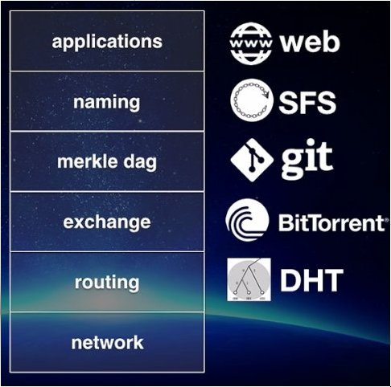
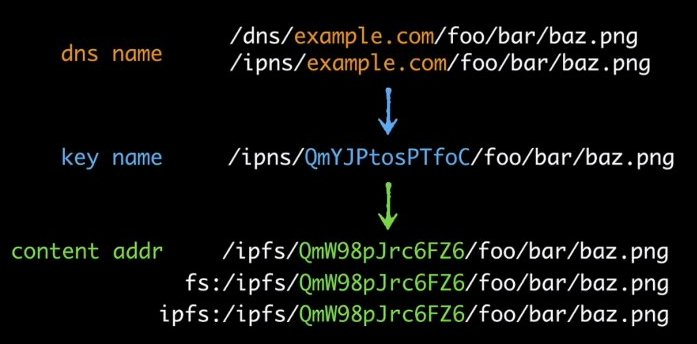

# Distributed web

Also called the permanent web. Why do we need a distributed web?

- We use a lot of tools that are unavailable offline (google docs, facebook, twitter, web-mail).
- In the outskirts of the internet bandwidth might be poor (rural or less developed areas).
- Weak wifi in public transport or airplanes.
- Sometimes you cannot move files from a mobile to a laptop without internet.
- Circumvent latency
- A centralized web can be shut off easily by malicious companies and governments (Egypt took the internet down on Jan 28th 2013).
- A centralized web is vulnerable (natural disasters, fire in data-center, power outages).
- Centralized web results in massive amount of unnecessary bandwidth usage (if we are all in the same room working on a Google Doc, we all have to download the document from the backbone).
- Permanence; avoids digital equivalent of book-burnings
- Webpages disappear because the author stops the hosting (dead links)
- Open web: everyone can publish and host (no hosting party needed)
- Digital vellum: information that is stored on legacy computers / operating systems / storage

## Bandwidth

In the past years bandwidth has increased to a lesser extent than the amount of storage you can get for the same money. This means that we can store bigger files on the web but we can not download them faster. In fact internet becomes slower if file-sizes increase at a faster pace than bandwidth.

## Location addressing

A url points to one location where the file can be found and you have to retrieve the file from that very location even if the file is available on a computer nearby.

## Goals:

1. Secure communications for humanity (Internet + Tor)
2. Secure computation for humanity (Web + IPFS)
3. Secure flourishing of knowledge (Wikipedia, Archives, Science, IPFS, Open Access)

# How it works

## Permanent addresses

IPFS uses permanent addresses by using DHT, so instead of a dns name it uses a hash that is derived from the content that it points to, much like git.

All pieces of content are linked together using hash on a granular object level. A piece of content is broken into smaller objects if its file-size exceeds 256K.

Hash linking provides a authenticated way of checking that the thing you are looking at is still the same thing and that nobody has changed it.

Hash links are not static; just like in git the branch `master` doesn't point to a static folder, it points to the latest commit so it can change as changes are applied to the content.

## Store pages and web-apps locally

As soon as a user visit an ipfs page or app, its get downloaded to the local ipfs repository, much like git. From this repository it can be served to peers directly, like bittorrent.

Once a page or web-app has been downloaded it can be viewed or used offline in a browser. You can also mount ipfs to your local filesystem (fuse) and access the app or page directly from disk.

# Links
- [SFS](https://en.wikipedia.org/wiki/Self-certifying_File_System)
- [Merkle tree](https://en.wikipedia.org/wiki/Merkle_tree)
- [DAG](https://en.wikipedia.org/wiki/Directed_acyclic_graph)
- [DHT](https://en.wikipedia.org/wiki/Distributed_hash_table)
- [libp2p](https://libp2p.io/)
- [beaker browser](https://beakerbrowser.com/)