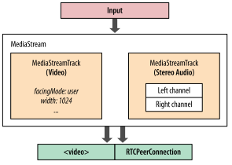
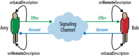

# P2P

**NB: de markdown implementatie van gitlab ondersteunt geen svg als plaatjes! Als je hieronder placeholders ziet kun je de svg alsnog zien door er op te klikken; het plaatje opent dan in een nieuwe tab**

Dit praatje gaat over p2p en ik behandel 2 p2p technologieën:

- ipfs
- webrtc

Behalve dat het allebei implementaties zijn van p2p hebben ze verder niets met elkaar te maken. Beide onderwerpen zijn enorm complex en uitgebreid en omvatten een boom aan protocollen en onderliggende technologieën. Dit praatje blijft helaas enigszins aan de oppervlakt maar voor meer diepgang kun je de links volgen.

## WebRTC

Ik begin met WebRTC. WebRTC is een open web standaard die in 2011 voor Chrome is bedacht voor een browser plugin die het mogelijk maakt om te bellen en te chatten via de webclient van gmail. Rond 2013 was WebRTC in Chrome en Firefox geïmplementeerd, in 2015 volgde Edge en op dit moment is Apple bezig het in te bouwen in Webkit / Safari (het is al beschikbaar in de Tech Preview).

WebRTC staan voor Web Real Time Communication. Met WebRTC is het mogelijk om audio en video streams (bijvoorbeeld van de je webcam) rechtstreeks naar een peer (bijvoorbeeld een andere browser) te streamen. Daarnaast kun je data streamen, onder data valt alles wat niet audio of video is.

RTC was al sinds 2008 / 2009 mogelijk met Flash maar de codecs waarmee de streams geoptimaliseerd werden waren proprietary en je moest je abonneren op een betaalde service om hiervan gebruik te kunnen maken. De codecs die WebRTC gebruikt zijn open source en omdat het in de meeste browsers is ingebouwd heb je geen onveilige plugin meer nodig. Er is een vrij eenvoudige Javascript API beschikbaar.


### Toepassingen

Toepassingen vallen vrijwel allemaal in 1 van de 3 categorieën conferencing, shared viewing platform en monitoring.

1. Video conferencing (bijvoorbeeld: [appear.in](https://appear.in), [talky.io](https://talky.io/)).
2. Versturen game status bij p2p games.
3. Monitoren van IP bewakingscamera's of bewakings drone.
4. Monitoren van machines d.m.v. het koppelen van meerdere speciale sensoren, b.v. infrarood camera, temperatuur, richtmicrofoons op bepaalde onderdelen van de machine; zodra de sensoren een bepaalde threshold waarde bereiken kan dit een indicatie zijn dat er iets mis aan het gaan is met de machine en kan de operator gewaarschuwd worden.
5. Teleleren (bijvoorbeeld: [codementor.io](https://www.codementor.io/))
6. Teleconsult; loodgieter kijkt mee met klant om te bepalen welke materialen ze moet kopen voordat ze ter plaatse gaat
7. AR en VR
8. Telehealth, personal training, personal shopping


Al deze toepassingen zitten in het vaarwater van de tradionele telecommunicatie vandaar dat naast de bekende tech bedrijven (Google, Mozilla, Opera, Microsoft en Apple) ook grote telecom en hardware bedrijven hebben meegewerkt aan het tot stand komen van de standaard en het implementeren van WebRTC in hun apparaten:

- Ericson
- Cisco

Inmiddels zijn er al behoorlijk wat bedrijven die goed geld verdienen met het aanbieden van services die ofwel WebRTC gebruiken ofwel daar een service voor leveren.

### Hoe werkt het

WebRTC is feitelijk een verzameling van 3 API's:

- MediaStream -> toegang tot streams van microfoon, webcam en AV files op de lokale schijf
- WebRTCPeerConnection -> voor audio en video streams
- WebRTCDataChannel -> voor applicatie data die niet audio of video is

#### MediaStream

MediaStream werd voorheen getUserMedia genoemd. Met deze API kun je de stream van een extern apparaat zoals een microfoon of webcam lokaal opvangen en bijvoorbeeld koppelen aan een `<video>` of `<audio>` element. Je kunt de stream ook koppelen aan een WebRTCPeerConnection en zodoende een video conferencing app maken.



#### UDP

TCP is tot nu toe veruit het meest gebruikte protocol in browsers. TCP levert een betrouwbare stroom van pakketjes in de juiste volgorde en als een pakketje kwijtraakt worden alle pakketjes die na dat pakketje binnen zijn gekomen gebufferd en wacht de stream tot het kwijtgeraakte pakketje opnieuw verstuurd is.

Precies om deze redenen gebruikt WebRTC UDP voor het verzenden van de data, dus UDP over IP, UDP/IP. UDP is een protocol met weinig overhead. UDP pakketjes zijn self-contained ze kunnen zelf hun weg vinden van zender naar ontvanger, zonder afhankelijk te zijn van eerder verzonden pakketjes.

Wat van belang is is dat UDP een zogenaamd null-protocol is:

- no guarantee of message delivery
- no guarantee of order of delivery
- no connection state tracking (stateless)
- no congestion control

Dit lijkt onhandig maar dit is juist erg geschikt voor streaming data over een lijn met wisselende bandbreedte. Want met streaming audio en video is betrouwbaarheid van de stream minder belangrijk dan de timeliness (de stiptheid, de timing). Als bij een video conference de audio stream bijvoorbeeld net als bij TCP zou gaan wachten tot een kwijtgeraakt pakketje opnieuw gestuurd wordt, of totdat de net-congestie is opgelost, raakt de audio uit sync met de video.


#### NAT

Het probleem van UDP is dat de meeste computers achter een NAT apparaat zitten (bv. een router). NAT staat voor Network Address Translation; het  vervangt per IP pakketje het IP-adres van de ontvanger of van de afzender. NAT is bedacht om het opraken van IP4 adressen uit te stellen; er zijn bepaalde ranges IP-adressen gereserveerd voor interne netwerken en deze lokale ranges kunnen hergebruikt worden. Het gaat op de volgende ranges:

- 10.0.0.0 - 10.255.255.255 => 16777216 lokale adressen
- 172.16.0.0 - 172.31.255.255=> 1048576 lokale adressen
- 192.168.0.0 - 192.168.255.255 => 65536 lokale adressen

Het uitsturen van een UDP datagram is geen probleem omdat alleen het adres en de poort van de afzender vertaalt hoeft te worden van intern naar extern: in ieder IP datagram (package) wordt het interne ip adres van de zender omgezet naar het externe publieke adres (bv 192.168.0.10 => 92.111.112.10) en van ieder UDP datagram wordt de interne poort omgezet naar de externe poort (bv 1337 => 15436).

Het probleem is het ontvangen van UDP pakketjes. Een TCP verbinding begint met een handshake en de verbinding wordt pas weer afgesloten na close message (of een timeout). De router kan de routing van extern adres:poort naar een intern adres:poort dus tijdelijk opslaan en kan er zo vanuitgaan dat ieder pakketje dat binnenkomt op een bepaalde adres:poort combinatie bij de juiste computer in het lokale netwerk aankomt.

UDP is echter stateless en daarom moeten er andere technieken gebruikt worden om UDP pakketjes naar het juiste adres en de juiste poort te kunnen routen: STUN en TURN, gecombineerd gebruikt in ICE trickle.


#### STUN

STUN staat voor Session Traversal Utilities for NAT en doet precies wat de naam doet vermoeden; het maakt een sessie aan die net als bij TCP een externe adres:poort tuple koppelt aan een interne adres:poort tuple. Verder worden er regelmatig keep-alive pakketjes gestuurd omdat UDP stateless is en er dus geen eind commando is. Feitelijk maakt STUN een UDP stream stateful.

De STUN functionaliteit draait op een externe server, de STUN server. Een client maakt connectie met een STUN server en de STUN server retourneert de externe adres:poort tuple van de client; deze gegevens kan de client vervolgens naar de peer sturen waarmee ze een p2p verbinding wil opzetten.

De functionaliteit van STUN is vrij eenvoudig en je zou zelf een STUN server kunnen schrijven. Google biedt een aantal gratis STUN servers aan maar er zijn meer gratis STUN servers, zie [deze lijst](https://gist.github.com/zziuni/3741933).


#### TURN

Helaas is STUN niet voor alle complexe NAT configuraties geschikt; in ongeveer 8% van de gevallen (volgens de verzamelde data van Google's STUN servers) lukt het niet om met STUN een p2p verbinding op te bouwen. Daarvoor is TURN in het leven geroepen: Traversal Using Relays around NAT. Ook TURN doet precies wat de naam aangeeft: de UDP pakketjes worden via een externe server verstuurd. Feitelijk is het daarmee dus geen p2p meer!

Omdat de UDP stream via de TURN server loopt verbruikt een TURN server veel bandbreedte en worden er ook zwaardere eisen gesteld aan de hardware. Om een TURN server te kunnen gebruiken moet je dan ook meestal een betaald account nemen. WebRTC begint daarmee steeds meer te lijken op RTC via de Flash plugin zoals ik eerder beschreef.


#### ICE Trickle

ICE staat voor Interactive Connectivity Establishment en dit is het proces van het tot stand brengen van een p2p verbinding. De ICE agent werkt met zogenaamde ICE candidates, dat zijn mogelijke verbindings routes.

Het trickle principe zorgt ervoor dat de p2p verbinding alijd over de kortst mogelijke route wordt opgebouwd:

- eerst wordt gekeken of de peers zich in hetzelfde lokale netwerk bevinden, dat is de makkelijkste en kortste route
- zo niet, dan wordt gekeken of er een STUN server geconfigureerd is en wordt geprobeerd of de verbinding met de door de STUN server teruggestuurde adres:poort tuples tot stand gebracht kan worden
- als dat niet lukt wordt er als er een TURN server geconfigureerd is een relay verbinding opgebouwd via deze TURN server

Een WebRTC configuratie ziet er bijvoorbeeld zo uit:

```javascript
const pc = new RTCPeerConnection({
    'iceServers': [
        {
            'url': 'stun:stun.l.google.com:19302'
        },
        {
            'url': 'turn:192.158.29.39:3478?transport=udp',
            'credential': 'JZEOEt2V3Qb0y27GRntt2u2PAYA=',
            'username': '28224511:1379330808'
        },
        {
            'url': 'turn:192.158.29.39:3478?transport=tcp',
            'credential': 'JZEOEt2V3Qb0y27GRntt2u2PAYA=',
            'username': '28224511:1379330808'
        }
    ]
});
```

Dit trickle proces kan zich tijdens een actieve p2p verbinding herhalen als dat nodig is, bijvoorbeeld als er een storing is in het netwerk kan er een andere route gekozen worden.

De ICE agent zorgt er ook voor dat er een keep alive signaal wordt verstuurd. De ICE agent is onderdeel van de WebRTC API waardoor de bovenstaande functionaliteit grotendeels weggeabstraheerd is.

#### Signaling

Een belangrijk onderdeel van p2p is het signaling mechanisme. Bij een p2p verbinding via de telefoon is het signaling mechanisme je ringtoon. In WebRTC is geen singaling ingebouwd en dat is een bewuste keuze omdat je op deze manier van bestaande signaling services gebruik kunt maken.

Je kunt bijvoorbeeld een WebRTC webclient verbinden aan een SIP (Session Initiation Protocal) service zodat je een PSTN (Public Switched Telephone Network) telefoon van een peer kunt laten overgaan.


Je kunt ook vrij eenvoudig je eigen signaling service bouwen, bijvoorbeeld door gebruikers van een chat zich te laten registreren met een username en hun email adres. Als je een p2p verbinding wilt opbouwen kun de username als telefoonnummer gebruiken en het email adres als signaal (de server verstuurd een email: "gebruiker X wil met je chatten". Of als de gebruiker al online is kan de server een push bericht sturen.

Een singaling service zorgt er ook voor dat de stream in het juiste formaat wordt verstuurd. Een peer die een verbinding wil maken met andere peer communiceert daarom welke codecs, formaten en afmetingen (video) er ondersteund worden. De ander peer slaat deze informatie op en communiceert zijn eigen constraints.



De hele verbinding in 1 plaatje:


#### Nog meer complexe zaken onder de motorkap

Het converteren van de streams naar de juiste formaten, afmetingen en codecs die door de peers worden ondersteund is onderdeel van WebRTC en is in de browser geimplementeerd: daar heb je dus geen omkijken naar. Andere zaken die in de browser zijn geimplementeerd zijn tools om de streams te optimaliseren voor alle omstandigheden:


Verder wordt alle encryptie en decryptie van de beveiligde verbinding door de browser afgehandeld.


- **ICE**: Interactive Connectivity Establishment (RFC 5245)
    - **STUN**: Session Traversal Utilities for NAT (RFC 5389)
    - **TURN**: Traversal Using Relays around NAT (RFC 5766)
- **SDP**: Session Description Protocol (RFC 4566)
- **DTLS**: Datagram Transport Layer Security (RFC 6347)
- **SCTP**: Stream Control Transport Protocol (RFC 4960)
- **SRTP**: Secure Real-Time Transport Protocol (RFC 37

DTLS is used to negotiate the secret keys for encrypting media data and for secure transport of application data.

SRTP is used to transport audio and video streams (WebRTCPeerConnection).

SCTP is used to transport application data (WebRTCDataChannel).

#### Sonstiges

Chrome een tooltje ingebouwd om WebRTC verbinding en stream te kunnen analyseren:

`chrome://webrtc-internals`

Verder is Wireshark een goede tool om de verstuurde pakketjes te bekijken.

### Conclusie

WebRTC is een complexe technologie die ondanks het feit dat het p2p is niet zonder externe server kan. Op dit moment wordt WebRTC voornamelijk gebruikt voor video conferencing en screensharing al dan niet met video, maar in combinatie met IoT zijn er nog enorm veel onontgonnen mogelijkheden.

Je zou je kunnen afvragen of als WebRTC via een TURN server loopt je niet beter kunt kiezen voor websockets, maar dan moet je alle logica voor beveiliging en optimalisatie zelf toevoegen op de client.

Er zijn veel voorbeeldjes van implementaties van WebRTC te vinden op github. Veel van dit soort voorbeeldjes zijn gemaakt rond 2013 en daarmee outdated, ze gebruiken een verouderde versie van WebRTC of werken om een andere reden niet meer in de huidige browsers.

Hier vind je een lijst met redelijk up-to-date WebRTC implementaties: [link](https://www.leggetter.co.uk/real-time-web-technologies-guide/)

### Links voor verdere verdieping

- O'reilly article about WebRTC [link](https://hpbn.co/webrtc/)
- O'reilly article about UDP [link](https://hpbn.co/building-blocks-of-udp/)
- Article [link](http://knowledge.santanu.net/what-is-webrtc-current-scenario-and-why-we-should-follow/)
- IoT and WebRTC [link](http://iot.ieee.org/newsletter/march-2016/iot-realtime-communications.html)
- A total replacement of traditional phone lines: sip.js [link](https://sipjs.com/)
- Business communication with WebRTC: onsip [link](https://www.onsip.com/)
- 4 WebRTC apps [link](https://www.onsip.com/blog/four-exciting-webrtc-applications-to-watch-in-2016)
- List of WebRTC services [link](https://www.leggetter.co.uk/real-time-web-technologies-guide/)
- Serverless WebRTC [blog](http://blog.printf.net/articles/2013/05/17/webrtc-without-a-signaling-server/) and [code](https://github.com/cjb/serverless-webrtc)
- tcp versus udp [link](http://www.mrc.uidaho.edu/mrc/people/jff/443/Handouts/Ethernet/Specific%20Protocols/TCP%20vs%20UDP%20-%20Difference%20and%20Comparison%20_%20Diffen.pdf)
- IMS [link](https://en.wikipedia.org/wiki/IP_Multimedia_Subsystem)
- VoLTE [link](https://en.wikipedia.org/wiki/Voice_over_LTE)
- Adobe Flash p2p [link](http://www.adobe.com/devnet/adobe-media-server/articles/p2p_apps_cirrus_lccs.html)
- Google Codelab WebRTC [link](https://codelabs.developers.google.com/codelabs/webrtc-web/#0)


## IPFS

IPFS staat voor Interplanetary File System en daarmee wordt gelijk de ambitie van het project duidelijk: het moet een file system zijn dat om kan gaan met slechte verbindingen en lange latency.

Het wordt ook wel het permanente web of het offline web genoemd. Dit houdt in de breedste zin in dat pagina's en webapps zonder netwerk verbinding toch blijven werken, en in engere zin dat het werkt als een centrale server eruit ligt.

### Nadelen HTTP

1. HTTP is gecentraliseerd en daardoor wordt het kwetsbaar:

- kwaadaardige overheden en bedrijven hoeven maar 1 server af te luisteren en kunnen dan al heel veel data vergaren
- kwaadaardige overheden en bedrijven hoeven maar 1 server plat te gooien om toegang tot een groot deel van het web te blokkeren
- een domeinnaam registratie of hosting kan worden beeindigd waardoor een gedeelte van het web onbereikbaar wordt (of verdwijnt)
- er kan ergens een datacenter of kabel stuk gaan
- DDOS attacks

2. HTTP is inefficient: een populaire youtube video wordt steeds van een Google server gehaald terwijl hij waarschijnlijk al een keer gedownload is door een computer in de buurt.

3. HTTP maakt ons te veel afhankelijk van de backbone, bijvoorbeeld als Google Docs plat ligt kun je niet meer bij je bestanden. Dit geldt ook voor de meeste andere cloud apps.


### Oplossingen IPFS

#### Content in plaats van adres

HTTP zoekt naar een adres, IPFS zoekt naar content. De naam van de content is een cryptografische hash die gebaseerd is op de content (zoals bij git). Zo weet je zeker dat de naam altijd naar hetzelfde en ongewijzigde bestand verwijst.

De hashes worden opgeslagen in DHT (Distributed Hash Table). DHT haalt het bestand op bij de verschillende seeds en checkt of het de juiste content is. Grote files worden opgesplitst in kleine brokjes (objects) van 255K zodat een file van meerdere seeds opgehaald kan worden en dus per saldo sneller kan inladen.

#### Directories

Een hash kan verwijzen naar een directory; de namen van de bestanden in die directory hoeven niet aangepast te worden, dit is dus een hele makkelijke manier om een bestaande folder van een webserver naar IPFS te verplaatsen.

#### Hash - human readable naam mapping

Hashes zijn lang en lastig te onthouden; met IPFS kun je de bestaande DNS infrastructuur gebruiken om makkelijkere namen te koppelen aan hashes. IPFS gaat in de toekomst waarschijnlijk ook [Namecoin](https://namecoin.org/) ondersteunen. Namecoin is een open source technologie die het mogelijk maakt om bepaalde componenten van het web te kunnen decentraliseren, waaronder DNS.

#### Hash - human readable naam mutable

Omdat de naam van een bestand gebaseerd is op de inhoud van dat bestand verandert de naam van het bestand als je iets aan de inhoud wijzigt. Dat kan onwenselijk zijn; met IPNS kun je hash aanmaken die altijd naar de laaste versie van een bestand wijst, net zoals een branchname op git altijd naar de laatste versie verwijst.

### Ontwikkeling

Op dit moment is er een implementatie van IPFS in go en een gedeeltelijke implementatie in javascript; als je deze installeert wordt je computer een IPFS node waarmee je bestanden en websites kunt publiceren via IPFS.

De implementatie in go is feitelijk een applicatie die git repository opzet voor gedownloade webcontent en functionaliteit heeft om IPNS adressen te mappen naar IPFS content. Verder kan de applicatie vergelijkbaar met bittorrent de bestanden die je hebt opgeslagen in je lokale repository seeden naar peers.

Op dit moment zijn er voor Chrome en Firefox plugins die globale IPNS adressen in de browser's adres balk resolven en de bijbehorende content downloaden naar je locale IPFS repository; vanaf daar kun je dan de content via een locale url bekijken (http://127.0.0.1/ipfs/...).

M.a.w.: je downloadt eerst de content en bekijkt deze dan vanaf je lokale kopie.

Zie verder dit document [link](https://tgrep.nl/dvandermeer/research/blob/master/ipfs/index.md).

