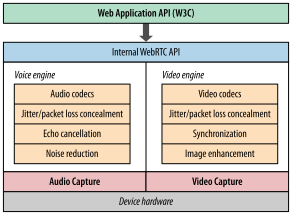

# P2P

Dit praatje gaat over p2p en ik behandel 2 p2p technologieën:

- ipfs
- webrtc

Behalve dat het allebei implementaties zijn van p2p hebben ze verder niets met elkaar te maken. Beide onderwerpen zijn enorm complex en uitgebreid en omvatten een boom aan protocollen en onderliggende technologieën dus in dit praatje kan ik niet al te diep op alles ingaan.

## WebRTC

Ik begin met WebRTC. WebRTC is een open web standaard die in 2011 voor Chrome is bedacht voor een browser plugin die het mogelijk maakt om te bellen en te chatten via gmail. Rond 2013 was WebRTC in Chrome en Firefox geimplementeerd, in 2015 volgde Edge en op dit moment is Apple bezig het in te bouwen in Webkit / Safari (het is al beschikbaar in de Tech Preview).

WebRTC staan voor Web Real Time Communication. Met WebRTC is het mogelijk om audio en video streams (bijvoorbeeld van de je webcam) rechtstreeks naar een peer (bijvoorbeeld een andere browser) te streamen. Daarnaast kun je data streamen, dus alles wat niet audio of video is.

RTC was al sinds 2008 / 2009 mogelijk met Flash maar nu is het dus ingebouwd in de meeste browsers en is er een vrij eenvoudige Javascript API beschikbaar.

### Toepassingen

1. video conferencing ([appear.in](https://appear.in))
2. versturen game status p2p games
3. monitoren van IP bewakingscamera's of bewakings drone
4. monitoren van machines d.m.v. meerdere speciale sensoren, b.v. infrarood camera, temperatuur, richtmicrofoons op bepaalde onderdelen van de machine
5. teleleren ([codementor.io](https://www.codementor.io/))
6. teleconsult; loodgieter kijkt mee met klant om te bepalen welke materialen ze moet kopen voordat ze ter plaatse gaat

Al deze toepassingen zitten in het vaarwater van de tradionele telecommunicatie vandaar dat naast de bekende tech bedrijven (Google, Mozilla, Opera, Microsoft en Apple) grote telecom / hardware bedrijven hebben meegewerkt aan het tot stand komen van de standaard en het implementeren van WebRTC in hun apparaten.

- Ericson
- Cisco

Inmiddels zijn er al een grote hoeveelheid bedrijven die goed geld verdienen met het aanbieden van services die ofwel WebRTC gebruiken ofwel daar een service voor leveren.

### Hoe werkt het

WebRTC is een verzamelijk van 3 API's:

- MediaStream -> toegang tot streams van microfoon, webcam en AV files op de locale schijf
- WebRTCPeerConnection -> voor audio en video streams
- WebRTCDataChannel -> voor applicatie data die niet audio of video is, bijvoorbeeld de game status van een p2p spel

#### MediaStream

MediaStream werd voorheen getUserMedia genoemd. Met deze API kun je de stream van een microfoon of webcam lokaal opvangen en bijvoorbeeld koppelen aan een `<video>` of `<audio>` element. Je kunt de stream ook koppelen aan een WebRTCPeerConnection en zodoende een video conferencing app maken.

#### UDP

WebRTC gebruikt UDP voor het verzenden van de data, dus UDP over IP, UDP/IP. UDP is een protocol met weinig overhead. UDP pakketjes zijn self-contained ze kunnen zelf hun weg vinden van zender naar ontvanger, zonder afhankelijk te zijn van eerder verzonden pakketjes.

TCP levert een betrouwbare stroom van pakketjes in de juiste volgorde en als een pakketje kwijtraakt worden alle pakketjes die na dat pakketje binnen zijn gekomen gebufferd en wacht de stream tot het kwijtgeraakte pakketje opnieuw verstuurd is.

UDP daarentegen is een zogenaamd null-protocol:

- no guarantee of message delivery
- no guarantee of order of delivery
- no connection state tracking (stateless)
- no congestion control

Dit lijkt onhandig maar dit is juist erg geschikt voor streaming data over een lijn met wisselende bandbreedte. Want met streaming audio en video is betrouwbaarheid van de stream minder belangrijk dan de timeliness, de stiptheid, de timing. Als bij een video conference de audio stream bijvoorbeeld net als bij TCP zou gaan wachten tot een kwijtgeraakt pakketje opnieuw gestuurd wordt, of totdat de net-congestie is opgelost, raakt de audio uit sync met de video.

#### NAT

Het probleem van UDP is dat de meeste computers achter een NAT apparaat zitten (bv. een router). NAT is bedacht om het opraken van IP4 adressen uit te stellen; de locale ranges kunnen immers hergebruikt worden:

- 10.0.0.0 - 10.255.255.255 => 16777216 lokale adressen
- 172.16.0.0 - 172.31.255.255=> 1048576 lokale adressen
- 192.168.0.0 - 192.168.255.255 => 65536 lokale adressen

Het uitsturen van een UDP datagram is geen probleem: in ieder IP datagram (package) wordt het interne ip adres van de zender omgezet naar het externe publieke adres (bv 192.168.0.10 => 92.111.112.10) en van ieder UDP datagram wordt de interne poort omgezet naar de externe poort (bv 1337 => 15436).

Het probleem is het ontvangen van UDP pakketjes. Een TCP verbinding begint met een handshake en de verbinding wordt pas weer afgesloten na close message (of een timeout). De router kan de routing van extern adres en poort naar intern adres en poort voor TCP pakketjes dus tijdelijk opslaan en kan er zo vanuitgaan dat ieder pakketje dat binnenkomt op een bepaalde externe poort naar de opgeslagen interne poort gestuurd moet worden.

UDP is echter stateless dus moeten er technieken gebruikt worden om UDP pakketjes naar het juiste adres en de juiste poort te kunnen routen.

#### STUN

STUN staat voor Session Traversal Utilities for NAT en doet precies wat de naam doet vermoeden; het maakt een sessie aan die net als bij TCP een externe adres:poort tuple koppelt aan een interne adres:poort tuple. Verder worden er regelmatig keep-alive pakketjes gestuurd omdat UDP stateless is en dus geen eind commando heeft. Feitelijk maakt STUN een UDP stream stateful.

De STUN functionaliteit draait op een externe server, de STUN server. Een client maakt connectie met een STUN server en de STUN server retourneert de externe adres:poort tuple van de client; deze gegevens kan de client vervolgens naar de peer sturen waarmee ze een p2p verbinding wil opzetten.

De functionaliteit van STUN is dus vrij eenvoudig en je zou zelf een STUN server kunnen schrijven. Google biedt een aantal gratis STUN servers aan maar er zijn meer gratis STUN servers, zie [hier](https://gist.github.com/zziuni/3741933).

#### TURN

Helaas is STUN niet voor alle complexe NAT configuraties geschikt; in ongeveer 9% van de gevallen lukt het niet om met STUN een p2p verbinding op te bouwen. Daarvoor is TURN in het leven geroepen: Traversal Using Relays around NAT. Ook hier doet het weer precies wat de naam aangeeft: de UDP pakketjes worden via een externe server verstuurd. Feitelijk is het daarmee dus geen p2p meer!

Omdat de UDP stream via de TURN server loopt verbruikt een TURN server veel bandbreedte en worden er ook zwaardere eisen gesteld aan de hardware i.v.m. een STUN server. TURN server werken dan ook allemaal met een betaald account.

#### ICE Trickle

ICE staat voor Interactive Connectivity Establishment en dit is het proces van het tot stand brengen van een p2p verbinding. De ICE agent werkt met zogenaamde ICE candidates, dat zijn mogelijke verbindings routes.

Het trickle principe zorgt ervoor dat de p2p verbinding over de korst mogelijke route wordt opgebouwd:

- eerst wordt gekeken of de peers zich in hetzelfde lokale netwerk bevinden, dat is de makkelijkste en kortste route
- zo niet, dan wordt gekeken of er een STUN server geconfigureerd is en wordt geprobeerd of de verbinding met de door de STUN server teruggestuurde adres:poort tuples tot stand gebracht kan worden
- als dat niet lukt met STUN wordt er een relay verbinding opgebouwd via de TURN server

Dit trickle proces kan zich tijdens een actieve p2p verbinding herhalen als dat nodig is, bijvoorbeeld als er een storing is in het netwerk.

De ICE agent zorgt er ook voor dat er een keep alive signaal wordt verstuurd. De ICE agent is onderdeel van de WebRTC API waardoor de bovenstaande functionaliteit grotendeels weggeabstraheerd is.

#### Signaling

Een belangrijk onderdeel van p2p is het signaling mechanisme. Bij een p2p verbinding via de telefoon is het signaling mechanisme je ringtoon. In WebRTC is geen singaling ingebouwd en dat is een bewuste keuze omdat je op deze manier van bestaande signaling services gebruik kunt maken.

Je kunt bijvoorbeeld een WebRTC webclient verbinden aan een SIP (Session Initiation Protocal) service zodat je een PSTN (Public Switched Telephone Network) telefoon van een peer kunt laten overgaan.

Je kunt ook vrij eenvoudig je eigen signaling service bouwen, bijvoorbeeld door gebruikers van een chat zich te laten registreren met een username en hun email adres. Als je een p2p verbinding wilt opbouwen kun de username als telefoonnummer gebruiken en het email adres als signaal (de server verstuurd een email: "gebruiker X wil met je chatten". Of als de gebruiker al online is kan de server een push bericht sturen.

Een singaling service zorgt er ook voor dat de stream in het juiste formaat wordt verstuurd. Een peer die een verbinding wil maken met andere peer communiceert daarom welke codecs, formaten en afmetingen (video) er ondersteund worden. De ander peer slaat deze informatie op en verstuurd communiceert zijn eigen constraints.

De hele verbinding in 1 plaatje:

#### Nog meer complexe zaken onder de motorkap

Het converteren van de streams naar de juiste formaten, afmetingen en codecs die door de peers worden ondersteund is onderdeel van WebRTC en in de browser geimplementeerd: daar heb je dus geen omkijken naar. Andere zaken die in de browser zijn geimplementeerd zijn tools om de streams te optimaliseren voor alle omstandigheden:

Verder wordt alle encryptie en decryptie van de beveiligde verbinding door de browser afgehandeld.

- **ICE**: Interactive Connectivity Establishment (RFC 5245)
    - **STUN**: Session Traversal Utilities for NAT (RFC 5389)
    - **TURN**: Traversal Using Relays around NAT (RFC 5766)
- **SDP**: Session Description Protocol (RFC 4566)
- **DTLS**: Datagram Transport Layer Security (RFC 6347)
- **SCTP**: Stream Control Transport Protocol (RFC 4960)
- **SRTP**: Secure Real-Time Transport Protocol (RFC 37

#### Sonstiges

Chrome een tooltje ingebouwd om WebRTC verbinding en stream te kunnen analyseren:

`chrome://webrtc-internals`

Verder is Wireshark een goede tool om de verstuurde pakketjes te bekijken.

### Conclusie

WebRTC is een complexe technologie die ondanks het feit dat het p2p is niet zonder externe server kan. Op dit moment wordt WebRTC voornamelijk gebruikt voor video conferencing en screensharing al dan niet met video, maar in combinatie met IoT zijn er nog enorm veel andere mogelijkheden.

Er zijn veel voorbeeldjes te vinden van implementaties van WebRTC te vinden op github. Veel van dit soort voorbeeldjes zijn gemaakt rond 2013 en daarmee outdated, ze gebruiken een verouderde versie van WebRTC of werken om een andere reden niet meer in de huidige browsers.

Hier vind je een lijst met redelijk up-to-date WebRTC implementaties: [link](https://www.leggetter.co.uk/real-time-web-technologies-guide/)

## IPFS

IPFS staat voor Interplanetary File System en daarmee wordt gelijk de ambitie van het project duidelijk: het moet een file system zijn dat om kan gaan met slechte verbindingen en lange latency.

Het wordt ook wel het permanente web of het offline web genoemd. Dit houdt in de breedste zin in dat pagina's en webapps zonder netwerk verbinding toch blijven werken, en in engere zin dat het werkt als een centrale server eruit ligt.

### Redenen voor een permanent web

- We use a lot of tools that are unavailable offline (google docs, facebook, twitter, web-mail).
- In the outskirts of the internet bandwidth might be poor (rural or less developed areas).
- Weak wifi in public transport or airplanes.
- Sometimes you cannot move files from a mobile to a laptop without internet.
- Circumvent latency
- A centralized web can be shut off easily by malicious companies and governments (Egypt took the internet down on Jan 28th 2013).
- A centralized web is vulnerable (natural disasters, fire in data-center, power outages).
- Centralized web results in massive amount of unnecessary bandwidth usage (if we are all in the same room working on a Google Doc, we all have to download the document from the backbone).
- Permanence; avoids digital equivalent of book-burnings
- Webpages disappear because the author stops the hosting (dead links)
- Open web: everyone can publish and host (no hosting party needed)
- Digital vellum: information that is stored on legacy computers / operating systems / storage

### Bandwidth

In the past years bandwidth has increased to a lesser extent than the amount of storage you can get for the same money. This means that we can store bigger files on the web but we can not download them faster. In fact internet becomes slower if file-sizes increase at a faster pace than bandwidth.

### Location addressing

A url points to one location where the file can be found and you have to retrieve the file from that very location even if the file is available on a computer nearby.

### Goals:

1. Secure communications for humanity (Internet + Tor)
2. Secure computation for humanity (Web + IPFS) -> emulate legacy computer systems
3. Secure flourishing of knowledge (Wikipedia, Archives, Science, IPFS, Open Access)

### How it works

#### In short

Copied from the [website](https://ipfs.io/):

- Each file and all of the blocks within it are given a unique fingerprint called a cryptographic hash.

- IPFS removes duplications across the network and tracks version history for every file.

- Each network node stores only content it is interested in, and some indexing information that helps figure out who is storing what.

- When looking up files, you're asking the network to find nodes storing the content behind a unique hash.

- Every file can be found by human-readable names using a decentralized naming system called IPNS.

#### Permanent addresses

IPFS uses permanent addresses by using DHT, so instead of a dns name it uses a hash that is derived from the content that it points to, much like git.

All pieces of content are linked together using hash on a granular object level. A piece of content is broken into smaller objects if its file-size exceeds 256K.

Hash linking provides an authenticated way of checking that the thing you are looking at is still the same thing and that nobody has changed it.

Hash links are not static; just like in git the branch `master` doesn't point to a static folder, it points to the latest commit so it can change as changes are applied to the content.

### Ontwikkeling

Op dit moment is er een implementatie van ipfs in go en een gedeeltelijke implementatie in javascript.

De implementatie in go installeer je op je locale machine en dit is feitelijk een applicatie die gitrepository opzet voor gedownloade webcontent en functionaliteit heeft om ipns adressen te mappen naar ipfs content. Verder kan de app vergelijkbaar met bittorrent als seed voor peers opereren.

Op dit moment zijn er voor Chrome en Firefox plugins die globale ipns adressen in de browsers resolven en de gevonden content downloaden naar je locale ipns installatie downloaden en vanaf daar kun je dan de content via een locale url bekijken.

M.a.w.: je download eerst de content en bekijkt het dan vanaf je lokale kopie.

#### Store pages and web-apps locally

As soon as a user visit an IPFS page or app, it gets downloaded to the local IPFS repository, much like git. From this repository it can be served to peers directly, like bittorrent.

Once a page or web-app has been downloaded it can be viewed or used offline in a browser. You can also mount IPFS to your local filesystem (fuse) and access the app or page directly from disk.

As you can see in the image above, IPFS content addresses don't use a colon which made it possible to mount IPFS to the local file system.

