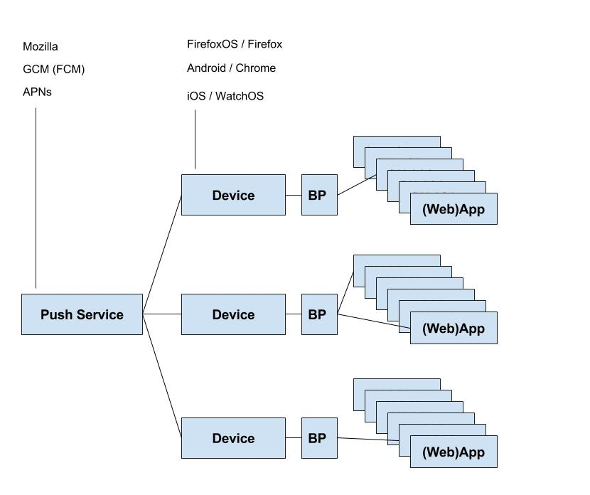
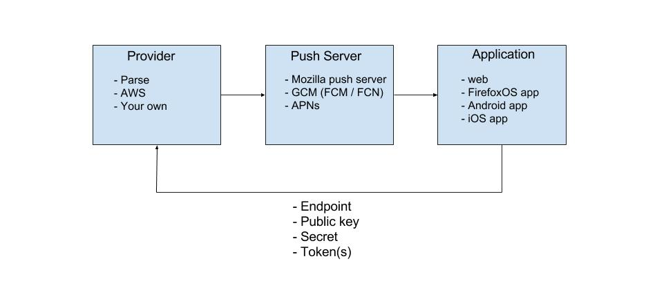

Deze presentatie gaat over push notifications: dit zijn notificaties op de client van het feit dat er een server push heeft plaatsgevonden.

# Notification API

Een notificatie kan zich op verschillende manieren manifesteren, afhankelijk van het apparaat en de status van het apparaat en het besturingssysteem. Mogelijke verschijningsvormen van een notificatie zijn:

- een melding op het homescreen (van een mobiel apparaat)
- een geluidje
- een popup
- alleen iOS: een badge bij het app icoontje, of als er al een badge getoond wordt het nummertje van de badge ophogen
- een combinatie van bovenstaande
- helemaal geen melding: dit is een zogenaamde `background push` die bijvoorbeeld iets wijzigt in de configuratie van een app waar de gebruiker niet over geinformeerd hoeft te worden.

Een notificatie wordt door het besturingssysteem gegenereerd. Voor Android en iOS is er een API beschikbaar om vanuit een native app een notificatie te genereren. Ook voor browsers is er een Notification API die inmiddels in vrijwel iedere moderne browser is geimplementeerd. Opvallend, maar niet verwonderlijk is dat met uitzondering van Chrome de mobiele versies van deze browsers geen notificaties ondersteunen.

Een native of webapp kan dus zelf een notificatie genereren, bijvoorbeeld een Ramadan app kan een notificatie geven wanneer het tijd is voor een gebed (om maar niet weer de Todo app van stal te halen).

Met MessageChannel kun je de payload van een notification van de ServiceWorker naar de application sturen: je hoeft dan dus niet een notificatie te tonen maar met de payload van de notification kun je bijvoorbeeld data van de applicatie updaten.

Let op: het is nog verplicht een notificatie te laten zien in FF en Chrome

# Push API

Een push is zoals gezegd een actie vanuit de server. Om een push van een server te kunnen ontvangen moet er continu een verbinding naar de server open staan. Het is niet efficient als iedere app zijn eigen socket verbinding onderhoudt. Daarom wordt de verbinding opgezet en onderhouden door 1 enkel background process dat de binnenkomende pushes distribueert naar de juiste apps. Met de Push API kun je je app registreren aan dit background process. Voor web-apps hebben op dit moment alleen Firefox en Chrome de Web Push API geimplementeerd.

Om veiligheidsredenen, met name voor native apps, kan niet zomaar iedere server een push verbinding opzetten en dus is er voor ieder os en iedere browser een eigen push service. Voor iOS apps is dat de APNs (Apple Push Notification service), voor Android apps en Chrome browsers GCM (Google Cloud Messages, nieuw: Firebase Cloud Messages) en voor Firefox browsers en FirefoxOS apps is er de Mozilla Push Service.

Native apps moeten vantevoren geregistreerd worden bij een push service. Tijdens deze registratie worden de benodigde certificaten (APNs) of keys (GCM) gegenereerd die je met je code mee moet compileren om daarmee de communicatie met de service op te kunnen zetten. Web apps hoef je niet vantevoren te registeren.

De communicatie tussen deze services en de (web) app gaat op basis van unieke tokens. Zo’n token is zeg maar een uniek adres voor een app op een specifiek device. Dezelfde app op een ander device heeft dus ook een ander token.

Zodra de app opstart meldt hij zich aan bij de service en deze geeft een token terug. Bij webapps geeft de service een subscription object terug met een property “endpoint”; dit is een capability url (USVString) wat in feite een combinatie is van de url van de service en het token.

Nadat de app zich heeft geregistreerd kan de server naar de app pushen. Een push gaat niet rechtstreeks naar de app maar via een background process op het os dat de binnenkomende pushes naar de juiste apps doorstuurt. Voor web apps is dit background process een ServiceWorker.

# Provider

Een push service kan dus een push sturen naar geregistreerde apps. Maar de push zelf wordt niet geïnitieerd door de push service maar door een provider. Een provider is een server die bepaalt of er iets gebeurd is dat de moeite waard is om naar de clients, dus de apps te pushen.

Een app moet zich dus ook registreren bij de provider omdat de provider aan de push service moet laten weten naar welke clients gepushed moet worden. We krijgen dan het volgende diagram:

Een app registreert zich dus eerst bij een push service waarna het een token terugkrijgt waarmee de app zich vervolgens registreert bij de provider.

De communicatie tussen de provider en de push service is ook beveiligd; voor APNs moet de provider een certificaat meesturen en voor GCM moet een key meegestuurd worden. Voor communicatie met de Mozilla Push Service kan de provider het endpoint gebruiken en voor de encryptie van een eventuele payload moet een key en een secret meegestuurd worden.

# Support Web Push

Chrome Linux, macOS, Windows, Android (not iOS!)
Firefox Linux, macOS, Windows (not Android!)
Opera N/A
Safari 9 N/A (maybe 10)
Edge N/A

Starting in iOS 8, you can optionally create actionable notifications by registering custom actions for a notification type. When an actionable notification arrives, the system creates a button for each registered action and adds those buttons to the notification interface. These action buttons give the user a quick way to perform tasks related to the notification. For example, a remote notification for a meeting invite might offer actions to accept or decline the meeting. When the user taps one of your action buttons, the system notifies your app, giving you an opportunity to perform the corresponding task.

# Links

- [demo](https://github.com/chrisdavidmills/push-api-demo)
- [Mozilla channel messaging](https://developer.mozilla.org/en-US/docs/Web/API/Channel_Messaging_API/Using_channel_messaging)
- [Mozilla autopush](https://github.com/mozilla-services/autopush)
- [Mozilla push service](https://mozilla-push-service.readthedocs.io/en/latest/)
- [Node apn](https://github.com/argon/node-apn)
- [Apple notifications](https://developer.apple.com/notifications)
- [Parse server](https://github.com/parse-community/parse-server)
- [Setup parse server on heroku](https://devcenter.heroku.com/articles/deploying-a-parse-server-to-heroku)
- [Provider deployed on heroku](http://provider-tg.herokuapp.com/)

