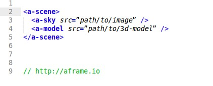
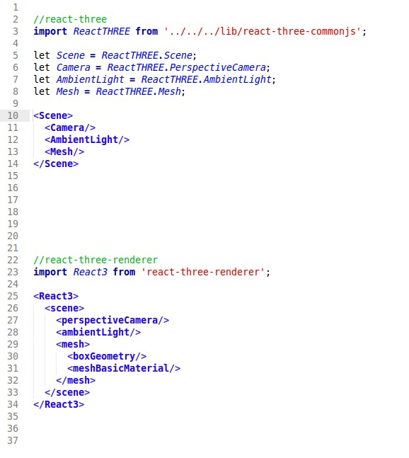
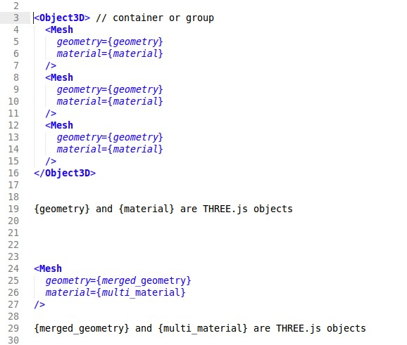
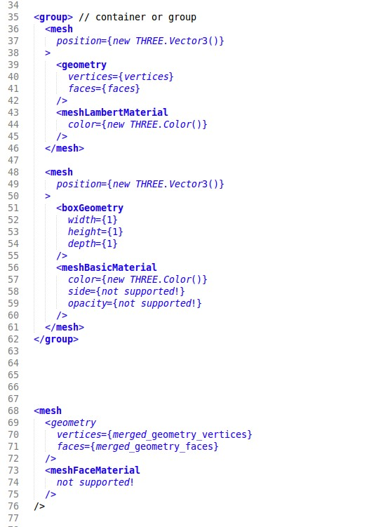
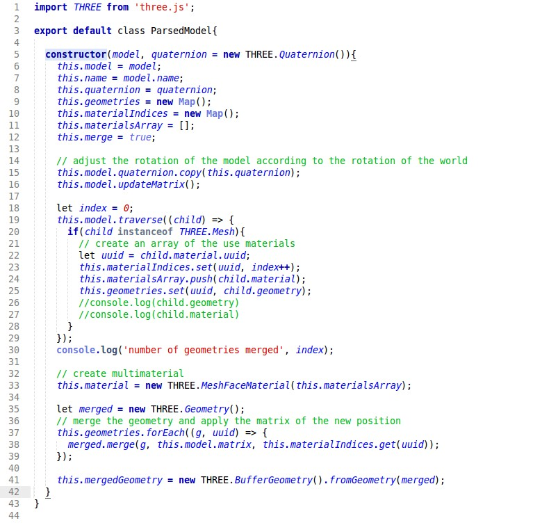
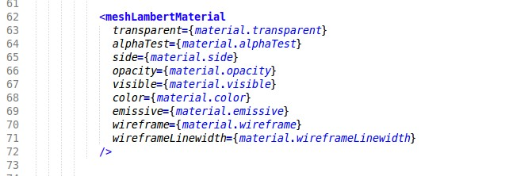
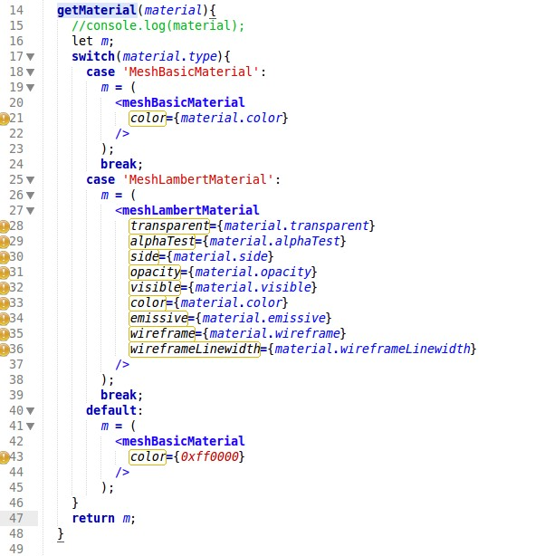

# React en WebGL

## Intro A-frame

Aanvankelijk zou ik iets vertellen over A-frame, een nieuwe javascript library van Mozilla waarmee je met een paar extra tags een 3D scene in html kunt renderen. Dat zit er ongeveer zo uit:



De <a-scene> start de rendering van de 3D scene.

Met de tag `<a-sky>` geef je aan welk plaatje voor de dome gebruikt wordt en met de tag `<a-model>` kun je een 3D model op de scene plaatsen.

Deze technologie is bedoeld om op een makkelijke manier bestaande html documenten up te graden voor gebruik met een VR apparaat. De tags worden genegeerd in browsers die de tags niet ondersteunen, of op pagina’s die de library niet includen.

Helaas is de code van de library nog niet vrijgegeven dus heb ik het niet kunnen testen. Te zijner tijd kun je de code vinden op [http://aframe.io](http://aframe.io) (update 24.07.2017: de website is inmiddels live)

Ik ga het nu hebben over react bindings voor Threejs en je zult zien dat je met jsx met soortgelijke declaratieve tags een 3D scene kunt opzetten.
Intro React

React zorgt voor beter state management, centraal state management, idealiter in alleen het top level component, en ingewikkelde DOM manipulaties worden sneller.

Met react bouw je feitelijk een virtuele DOM. Veranderingen in de state van een applicatie, bijvoorbeeld door user input, data van de server of een verandering in de state van een device (rotatie, offline, batterij leeg, locatie etc.) worden eerst alleen doorgevoerd in deze virtuele DOM.

Vervolgens wordt het minimale aantal mutaties uitgerekend dat nodig is om de virtuele DOM in overeenstemming te brengen met de DOM in de browser. Dit proces heet reconciliation, to reconcile betekent letterlijk “met elkaar in overeenstemming brengen”

De berekening van het minimale aantal mutaties wordt gedaan door een intelligent algoritme dat door Facebook regelmatig wordt upgedate om veel voorkomende mutaties nog sneller uit te kunnen voeren.

Allereerst wordt de tree van de virtuele DOM node voor node vergeleken met de DOM in de browser. De hele tree onder de eerste node die niet overeenkomt wordt volledig vervangen.

Als de tree overeenkomt wordt gekeken naar verschillen in de properties van de nodes, dus van de componenten.

Nadat de minimale set mutaties is uitgerekend wordt het renderen van de nieuwe DOM vervolgens gewoon in de browser afgehandeld.

Een DOM manipulatie is een dure operatie, dus hoe minder manipulaties uitgevoerd hoeven te worden hoe meer responsive je site is.

## React bindings

Voor steeds meer UI libraries en technieken komen er react bindings. Er zijn dus react bindings voor Threejs, maar ook bijvoorbeeld voor D3.js en SVG.

Hoe werken deze bindings nou precies? Je kunt een binding vergelijken met een custom component dat je aanmaakt in react, bijvoorbeeld:

```html
<div>
  <label for="key">{this.props.label}<input type="text" id="key"></label>
</div>
```

Dit custom component noem je bijvoorbeeld “MyInput” en deze kun je in JSX toevoegen aan de tree:

```html
<parent>
  <MyLabel label="first name"/>
</parent>
```

Voor react zijn naam van de tag en de eventuele namen en waardes van de properties van belang omdat deze gebruikt worden tijdens het reconciliation proces. Wat het component verder allemaal doet tijdens het renderen van de UI is volledig transparent voor React.

Laten we kijken naar Object3D, dit is de basis klasse voor de meeste Threejs objecten. Stel we maken een custom component Object3D aan, die zou je dan als volgt kunnen renderen:

```html
<parent>
  <Object3D position="Vector(0,100,0)" rotation="Vector(0,1,1)">
</parent>
```

Voor react is alleen de tag `Object3D` van belang en de namen en waarden van de properties. In de code van het Object3D component, dus buiten het zicht van react, wordt gewoon een nieuwe instantie aangemaakt van THREE.Object3D met de gezette properties:

```javascript
let o3 = new THREE.Object3D;
o3.position.set(this.props.position);
o3.rotation.set(this.props.rotation);
```

In plaats van bindings wordt ook wel de term wrapper of descriptor gebruikt. Persoonlijk vind ik descriptor een goede term omdat dat is wat je feitelijk doet: je beschrijft je custom UI component zodat react er mee om weet te gaan.

## React bindings voor Threejs

De eerste vraag die zich aandient is: waarom zouden we react willen gebruiken voor een Threejs applicatie?

Bij de DOM heeft het aantal mutaties dat doorgevoerd moet worden een impact op de performance, maar in Threejs wordt sowieso de hele scene opnieuw gerenderd naar de WebGL context van het canvas element en daarbij maakt het aantal mutaties dus niet uit.

Wat dus overblijft zijn de zaken die vóór het renderen liggen, dus de virtuele DOM en het state management. Op zich heeft Threejs ook een soort van virtuele DOM omdat je eerst een hele scene opbouwt die pas gerenderd wordt op het moment dat je de render methode van Threejs aanroept, maar deze is niet persé handig gestructureerd.

Het grootste voordeel is het state management: react dwingt je met zachte hand tot zo weinig mogelijk state met idealiter alleen een stateful top level component. Dus je code wordt helderder en dus beter onderhoudbaar. Daarbij is je code beter inpasbaar in bestaande react apps.

[Het bijhouden van de state is niet handig geregeld in Threejs, en meestal is usercode ook dusdanig opgezet dat de state verknipt is over meerdere elementen.]

Er zal misschien ook een hele kleine winst qua performance gehaald kunnen worden tijdens het reconciliation proces: het algoritme van react is waarschijnlijk sneller in het detecteren van de wijzigingen en het klaarzetten van de nieuwe scene dan je eigen code. Voorwaarde is wel dat de bindings voor Threejs goed zijn opgezet, hierover later meer.

Een bijkomend voordeel van react zijn de browser tools. Normaal is je 3D scene gewoon een bak met pixels, maar in de browser tools kun je hierarchische structuur van je 3D scene duidelijk zien. Ook kun je properties live aanpassen wat handig is voor debuggen. In de praktijk vond ik de browser tools super handig!

## Twee libraries met react bindings voor Threejs

Er zijn 2 libraries die react binden aan Threejs: `react-three` en `react-three-render`. `react-three` is ouder en lijkt stabiel en is geschreven in es5, `react-three-renderer` is jonger, geschreven in es6 en heeft nog wel een boel issues maar is wel wat ambitieuzer qua opzet. Beide libraries zijn recent nog upgedate.

De aanpak van beide libraries is nogal verschillend: `react-three` heeft maar een paar componenten, bijvoorbeeld voor Scene, Camera, Light, Mesh en Object3D. In totaal is er voor 17 Threejs klassen een react descriptor.

`react-three-renderer` heeft als doel om voor alle (relevante) Threejs klassen een react component te maken. Ik schat dat op dit moment ongeveer 90% van alle klassen een component heeft. Er wordt dus niet met composit componenten gewerkt, waarover later meer.

Overigens zijn nog niet in alle componenten ook alle properties van de onderliggende klasse beschikbaar. Bijvoorbeeld zij er geen `opacity` en `side` properties in het `meshBasicMaterial` component, terwijl je die parameters wel kunt zetten in de onderliggende klasse `MeshBasicMaterial`. In `react-three` worden alle properties van de onderliggende Threejs klasse ondersteund.

Verder werkt `react-three-renderer` met interne componenten die binnen het top-level component React3 herkend worden, vergelijkbaar zoals span, div etc. binnen React herkend worden.

Voordeel hiervan is dat je niet voor ieder component een aparte module in je code hoeft te importen of te definieren.

## Uitleg verschil in aanpak

Laten we eens kijken hoe het verschil in aanpak uitwerkt in je (JSX) code:



Je ziet 2 dingen: in `react-three` kunnen we zelf de namen van de componenten bepalen, omdat de conventie is om custom componenten met een hoofdletter te schrijven, doen we dat hier ook.

Bij `react-three-renderer` kunnen we de namen niet zelf bedenken, het interne componenten binnen het top-level component React3. De namen van de interne componenten beginnen met een kleine letter.

Verder valt direct het verschil in granulariteit op. In `react-three` zie je dat Mesh een composit component is want met de parameters `geometry` en `material` worden gewoon Threejs objecten meegegeven.

In `react-three-renderer` is een Mesh geen composite component en zijn geometries en materials dus ook componenten. Zoals je ziet komen de namen overeen met de namen van de onderliggende Threejs klassen.

Het verschil in granulariteit zou een verschil kunnen opleveren tijdens de reconciliation. Zoals gezegd vergelijkt het reconcile algoritme eerst de trees van de virtuele DOM en de actuele DOM en daarna pas de properties per component. Zie ook de documentatie van React [link].

Het zou kunnen dat het updaten van de properties (de attributen van de tag) intensiever is dan het vervangen van een hele tree. In dat geval zou `react-tree-renderer` iets efficienter zijn.

Maar als dat al zo is gaat het hier denk ik om hele minimale marges. Het efficient diffen is niet het grootste voordeel van React, het voordeel van efficient diffen merk je pas op het moment dat er minder DOM manipulaties uitgevoerd hoeven te worden. Maar zoals gezegd rendert Threejs sowieso de hele scene.


## Inladen modellen

Het inladen van modellen vergt een extra parse stap. De loaders van Threejs parsen de ingeladen modellen namelijk naar een container object die uit meerdere meshes kan bestaan. Deze moeten in `react-three` als losse react componenten aan de tree worden toegevoegd. In `react-three-renderer` moeten we ook de geometries en de materials als component renderen.

Zie de 2 plaatjes hieronder:

react-three:




react-three-renderer:




Zoals je ziet kunnen de geometries ook worden gemerged; dat levert enerzijds een performance voordeel op in WebGL en beperkt anderzijds het aantal componenten dat je aan moet maken. Helaas wordt multimaterial nog niet ondersteund in `react-three-renderer`.

Ik heb een klasse gemaakt die uit een ingeladen 3D model de gebruikte geometries en materials parsed:



Voor `react-three-renderer` kunnen we de vertices en faces uit het geometry object zelf halen: geometry.vertices en geometry.faces.

Maar de materialen ligt dat wat anders:



Dus daar heb ik ook een functie voor gemaakt. Nog niet alle typen material zitten erin:



## Nadelen

Je hebt geen directe toegang meer tot de WebGL renderer.

In `react-three-renderer` wordt de WebGL renderer met rAF aangeroepen, dus ook als er niets is veranderd in de scene wordt de 3D scene opnieuw gerenderd. Dit heeft een behoorlijke performance impact: in [TJT](https://tekenjetuin.nl) hebben we de automatische render loop uitgezet en roepen de render alleen aan als er ook daadwerkelijk iets veranderd is in de scene.

Voor 3D scenes met doorlopende animaties kun je niet anders dan de WebGL render methode aan rAF koppelen, maar voor de meeste applicaties die wij tot nu toe gemaakt hebben is dat niet nodig.

In `react-three` staat automatisch renderen standaard aan, maar kun je het uitzetten door de property `enableRapidRender` van het Scene component op `false` te zetten. In dat geval is de WebGL render methode gekoppeld aan de react render methode, dat is ideaal.

# Controls.

Met plain Threejs kun je een controller makkelijk direct koppelen aan de camera. Dit is eigenlijk een antipattern.

Je kunt in `react-three` controls gebruiken, maar die werken alleen icm rapidRender. Ik heb iets aangepast in de code zodat de render methode ook wordt aangeroepen na een onChange event van de controls.

In `react-three-renderer` zul je het `onChange` event van een controller moeten omrekenen naar properties voor het camera component zodat je deze via een state change kunnen worden doorgevoerd.

## Conclusie

Voor snelheidswinst qua renderen hoef je het niet te doen, maar het levert wel mooiere code op en het is beter inpasbaar in een bestaand react project.

`react-three-renderer` is veelbelovend maar nog te onvolwassen. Omdat deze library een ambitieuzere opzet heeft is het lastiger om iets aan te passen: het vergt wat tijd om je in de code in te werken.

`react-three` lijkt stabiel, ik ben nog geen rare dingen tegengekomen. De code is  wat simpeler opgezet dus je kunt makkelijker dingen aanpassen. Nadeel is wel dat Threejs r73 nog niet ondersteund wordt.

## Update

Er zijn wat nieuwe ontwikkelingen. `react-three-renderer` lijkt zich sneller te ontwikkelen dan `react-three`, zo is het inmiddels mogelijk om de automatische rendering uit te zetten.

Het inbouwen van controls zoals OrbitControls bleek uiteindelijk vrij simpel te zijn. Ik kwam wel iets interessants tegen: het automatisch renderen kost minder CPU vergeleken met handmatig renderen. Dat leek op het eerste gezicht vreemd, maar het komt waarschijnlijk doordat het interval tussen de opeenvolgende change events van de sliders of van de controls kleiner is dan het interval tussen 2 frames.

Ook is de werking van de OrbitControls anders dan bij `react-three`, eigenlijk klopt de implementatie in `react-three-renderer` niet.
